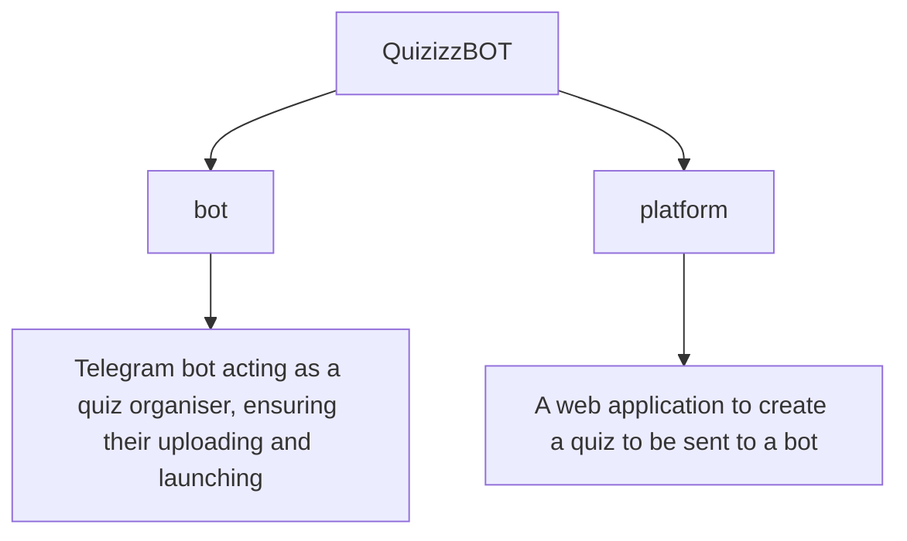

# Quizizz Telegram Bot
---


## About
A two-part project

Platform - provides the ability to build a quiz on the site and get an output `.json` file with quiz info that the bot needs to start the quiz

Bot - provides access levels for teacher and student, teacher is able to upload `.json` files and start the quiz. At the time the student is able to take it

---
## Installation
*Of course install [NodeJS](https://nodejs.org/en) previously


1. Clone the repository
```
git clone https://github.com/FeliksNovoselskyi/QuizizzBOT.git
```
2. Choose directory of the project
3. Install packages
```
npm install
```
4. Create your own `.env` file in main directory

5. Write the information required for the bot and platform here as in the `.env-sample` file in main directory

6. Then choose what project do you wanna to start
### BOT
7. Choose Telegram BOT directiory
```
cd bot
```

8. Run the project (run `index.js`)
```
node index.js
```

### PLATFORM
7. Choose Platform directiory
```
cd platform
```

8. Run the project (run `server.js`)
```
node server.js
```

### Importantly
There is an `questions.json` file in the project directory

You can use it to create a quiz when the bot asks you to upload a `.json` file with the questions for the quiz

---
## Technologies Used
>[Back to top](#quizizz-telegram-bot)

| **Technology**  | **Description** |
| ------------- | -------------      |
| [NodeJS](https://nodejs.org/uk)       | The main framework on which the bot and the platform are built  |
| [Express](https://expressjs.com/)  | Web framework used to build the platform  |
| [JavaScript](https://developer.mozilla.org/en-US/docs/Web/JavaScript)  | The primary programming language  |
| [Sequelize ORM](https://sequelize.org/)  | ORM (Object-Relational Mapping) used for interacting with the database  |
| [node-telegram-bot-api](https://www.npmjs.com/package/node-telegram-bot-api)  | API used to develop a Telegram bot  |
| [EJS](https://ejs.co/)      | A simple templating language used for developing website templates |
| [jQuery](https://jquery.com/)                                                  | A JavaScript library that simplifies development and interaction within the project.                              |
| [Sortable](https://jqueryui.com/sortable/)                                     | A jQuery plugin that allows smooth and quick drag-and-drop functionality for reordering items.                    |
| [AJAX](https://api.jquery.com/category/ajax/)                                  | A technology for fast and convenient data handling without page refreshes.                                        |
| [Fetch API](https://developer.mozilla.org/en-US/docs/Web/API/Fetch_API)        | Used for asynchronous operations on the site without constant page refreshes.                                     |
| [HTML](https://developer.mozilla.org/en-US/docs/Web/HTML)/[CSS](https://developer.mozilla.org/en-US/docs/Learn/CSS) | Languages used for website layout, structure, and styling.                   |
| [Bootstrap 5](https://getbootstrap.com/)                                       | A frontend framework used to create various elements on the pages.                                                |
| [Figma](https://help.figma.com/hc/en-us)                                       | An online service used for designing the site's layout.                                                           |
| [SQLite3](https://www.sqlite.org/docs.html)                                    | A database used for site development.                                                                             |

---
## Project structure
>[Back to top](#quizizz-telegram-bot)


---
## Figma and FigJam
>[Back to top](#quizizz-telegram-bot)
* [Figma](https://www.figma.com/design/jMjdkaAEDIh5ONLtelxzi7/QuizizzBOT-Platform?node-id=0-1&t=Y2RKr0VkKNAYPncM-1)
* [FigJam](https://www.figma.com/board/AZD4TR2pNnDRlWKSJgVxKp/QuizizzBOT-Structure?node-id=0-1&t=FxYQlPNAcjUQaIe8-1)

---
>[Back to top](#quizizz-telegram-bot)
# Enjoy using it!
# Enjoy exploring it!