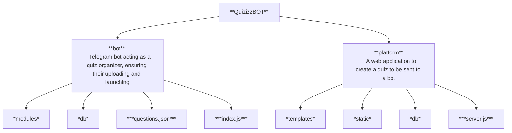

# Quizizz Telegram Bot
---


## About
A ***two-part*** project

**Platform** - provides the ability to build a quiz on the site and get an output `.json` file with quiz info that the bot needs to start the quiz

**Bot** - provides access levels for *teacher* and *student*, *teacher* is able to upload `.json` files and start the quiz. At the time the *student* is able to take it

---
## Installation
*Of course install [NodeJS](https://nodejs.org/en) previously


1. Clone the repository
```
git clone https://github.com/FeliksNovoselskyi/QuizizzBOT.git
```
2. Choose main directory of the project
3. Install packages
```
npm install
```
4. Create your own `.env` file in main directory

5. Write the information required for the **bot** and **platform** here as in the `.env-sample` file in main directory

6. Then choose what project do you wanna to start
### BOT
7. Choose `/bot`
```
cd bot
```

8. Create the `/uploaded_files` directory
(copies of the quiz files you upload as a teacher will be saved there)
```
mkdir uploaded_files
```

9. Run the project (run `index.js`)
```
node index.js
```

### PLATFORM
7. Choose `/platform`
```
cd platform
```

8. Run the project (run `server.js`)
```
node server.js
```

### Importantly
There is an `questions.json` file in the project directory

You can use it to create a quiz when the **bot** asks you to upload a `.json` file with the questions for the quiz

---
## Technologies Used
>[Back to top](#quizizz-telegram-bot)

| **Technology**  | **Description** |
| ------------- | -------------      |
| [NodeJS](https://nodejs.org/uk)       | The main framework on which the bot and the platform are built  |
| [Express](https://expressjs.com/)  | Web framework used to build the platform  |
| [JavaScript](https://developer.mozilla.org/en-US/docs/Web/JavaScript)  | The primary programming language  |
| [Sequelize ORM](https://sequelize.org/)  | ORM (Object-Relational Mapping) used for interacting with the database  |
| [node-telegram-bot-api](https://www.npmjs.com/package/node-telegram-bot-api)  | API used to develop a Telegram bot  |
| [EJS](https://ejs.co/)      | A simple templates language used for developing website templates |
| [jQuery](https://jquery.com/)                                                  | A JavaScript library that simplifies development and interaction within the project.                              |
| [Sortable](https://jqueryui.com/sortable/)                                     | A jQuery plugin that allows smooth and quick drag-and-drop functionality for reordering items.                    |
| [AJAX](https://api.jquery.com/category/ajax/)                                  | A technology for fast and convenient data handling without page refreshes.                                        |
| [Fetch API](https://developer.mozilla.org/en-US/docs/Web/API/Fetch_API)        | Used for asynchronous operations on the site without constant page refreshes.                                     |
| [HTML](https://developer.mozilla.org/en-US/docs/Web/HTML)/[CSS](https://developer.mozilla.org/en-US/docs/Learn/CSS) | Languages used for website layout, structure, and styling.                   |
| [Bootstrap 5](https://getbootstrap.com/)                                       | A frontend framework used to create various elements on the pages.                                                |
| [Figma](https://help.figma.com/hc/en-us)                                       | An online service used for designing the site's layout.                                                           |
| [SQLite3](https://www.sqlite.org/docs.html)                                    | A database used for site development.                                                                             |

---
## Project structure
>[Back to top](#quizizz-telegram-bot)


---
## Figma and FigJam
>[Back to top](#quizizz-telegram-bot)
* [Figma](https://www.figma.com/design/jMjdkaAEDIh5ONLtelxzi7/QuizizzBOT-Platform?node-id=0-1&t=Y2RKr0VkKNAYPncM-1)
* [FigJam](https://www.figma.com/board/AZD4TR2pNnDRlWKSJgVxKp/QuizizzBOT-Structure?node-id=0-1&t=FxYQlPNAcjUQaIe8-1)


---
## Documentation
>[Back to top](#quizizz-telegram-bot)

Full-fledged documentation for the project, contains introductory information for further acquaintance and work on the project for other developers

---
### For platform
First of all, we familiarize ourselves with the structure of the database, platform models

In the platform's file system, there is a `/db` folder (as well as in the bot's file system)

A database will be created in the `/db` folder, with the name you specify in the `.env` file (fill it according to the example in `.env-sample`)

In the database, you will be able to track:
- Adding test questions
- Deleting questions
- Changing their order

And so, let's move on to the files

#### DB functionality
File `dbSetup.js`:
```javascript
import {Sequelize} from 'sequelize'
import dotenv from 'dotenv'

import {fileURLToPath} from 'url'
import {dirname, join} from 'path'


dotenv.config({path: '../.env'})

const __filename = fileURLToPath(import.meta.url)
const __dirname = dirname(__filename)

// Create an instance of the Sequelize class, which will be an ORM, to work with the db
export const sequelize = new Sequelize(process.env.PLATFORM_DB_NAME, process.env.PLATFORM_DB_ADMIN_NAME, process.env.PLATFORM_DB_PASSWORD, {
    host: 'localhost',
    dialect: 'sqlite',
    storage: join(__dirname, `${process.env.PLATFORM_DB_NAME}.db`)
})

// Sync DB
sequelize.sync()
    .then(() => {
        console.log('Database created successfully')
    })
    .catch((error) => {
        console.log('Error during creating database:', error)
    })
```

This file prepares the database for further use and synchronizes it

Sequelize ORM is used

The data required to create the database is uploaded from the `.env` file, such as:
- Database Name
- Database administrator name
- Database password

Traditionally, as in all project files, there are comments, sometimes short and clear, sometimes clearly described in detail
All for the sake of convenience of further use and development, as well as simple and qualitative familiarization with the project code

Let's move on

File `models.js`:
```javascript
import {DataTypes} from 'sequelize'

// My scripts
import * as dataBase from './dbSetup.js'

// Questions model
export const Questions = dataBase.sequelize.define('Questions', {
    id: {
        type: DataTypes.INTEGER,
        autoIncrement: true,
        primaryKey: true
    },
    questionText: {type: DataTypes.STRING},
    answer1: {type: DataTypes.STRING},
    answer2: {type: DataTypes.STRING},
    answer3: {type: DataTypes.STRING},
    answer4: {type: DataTypes.STRING},
    correctAnswer: {type: DataTypes.INTEGER},
    order: {type: DataTypes.INTEGER, defaultValue: 0}
})
```

A file containing absolutely all the models for the platform database

Let's move on to the rest of the platform structure:
- `server.js`
- `/templates`
- `/static`

#### Server part
File `server.js`:
```javascript
import express from 'express'
import dotenv from 'dotenv'
import csrf from "csurf"
import cookieParser from 'cookie-parser'

import {fileURLToPath} from 'url'
import {dirname, join} from 'path'

// My scripts
import * as models from './db/models.js'

dotenv.config({path: '../.env'})

const app = express()

// PORT and HOST (from .env file or basic values)
const PORT = process.env.PORT || 3000
const HOST = process.env.HOST || 'localhost'

const __filename = fileURLToPath(import.meta.url)
const __dirname = dirname(__filename)

app.set('view engine', 'ejs')
app.set('views', './templates')

// Setup static routes
app.use('/static/', express.static(join(__dirname, 'static')))
app.use('/css', express.static(join(__dirname, 'node_modules/bootstrap/dist/css')))
app.use('/js', express.static(join(__dirname, 'node_modules/bootstrap/dist/js')))
app.use('/js', express.static(join(__dirname, 'node_modules/jquery/dist')))

app.use(express.urlencoded({extended: true}))
app.use(express.json()) // for json parsing after ajax requests

// CSRF protection
app.use(cookieParser())

const csrfProtection = csrf({cookie: true})
app.use(csrfProtection)

app.use((req, res, next) => {
    res.locals.csrfToken = req.csrfToken()
    next()
})

let context = {}

// Render of the main page
app.get('/', async (req, res) => {
    context.error = null

    // Preparing questions in their order (in ascending order)
    const allQuestions = await models.Questions.findAll({
        order: [['order', 'ASC']]
    })
    const questionData = allQuestions.map(question => question.dataValues)
    context.questionData = questionData

    res.render('main', context)
})

// Post requests on main page
app.post('/', csrfProtection, async (req, res) => {
    context = {}

    const {
        questionTextInput, 
        answer1Input, 
        answer2Input, 
        answer3Input, 
        answer4Input, 
        correctAnswerIndex, 
        action, 
        cell_order
    } = req.body

    if (action === "createQuest") {
        if (!questionTextInput || !answer1Input || !answer2Input || !answer3Input || !answer4Input) {
            // Unfilled inputs during creation of question
            // response to ajax
            return res.status(400).json({error: 'Fill all inputs to create a question'})
        } else if (correctAnswerIndex == null) {
            return res.status(400).json({ error: 'Choose only one correct answer within the valid range (1-4)' })
        } else {
            const newQuestion = await models.Questions.create({
                questionText: questionTextInput,
                answer1: answer1Input,
                answer2: answer2Input,
                answer3: answer3Input,
                answer4: answer4Input,
                correctAnswer: correctAnswerIndex
            })

            // Successfully created question
            // response to ajax
            return res.status(200).json({
                id: newQuestion.id,
                questionText: questionTextInput,
                answer1: answer1Input,
                answer2: answer2Input,
                answer3: answer3Input,
                answer4: answer4Input,
                correctAnswer: correctAnswerIndex,
                message: 'Question added successfully!'
            })
        }
    }

    if (action === "deleteQuest") {
        // get questionId from the submitted form (from hidden input)
        const questionId = req.body.questionId

        // if the questionId was missed at the time of receipt
        if (!questionId) {
            return res.status(400).json({error: 'Question ID is missing'})
        }

        // Trying to delete question from db
        try {
            await models.Questions.destroy({
                where: {id: questionId}
            })

            // Successfully deleted question
            return res.status(200).json({deleteQuestion: true})
        } catch (error) {
            console.error(error)

            // Probably errors during question deleting
            return res.status(400).json({error: 'Failed to delete question'})
        }
    }

    // If the item order (in this case, QUESTIONS) has been updated
    if (action === "cellOrderUpgrade") {
        for (const item_order of cell_order) {
            await models.Questions.update(
                {order: item_order.order},
                {
                    where: {id: item_order.id}
                }
            )
        }
    }

    // If a teacher wants a .json file of questions
    if (action === "downloadFile") {
        try {
            // Receiving questions in the order they appear in the db
            const questions = await models.Questions.findAll({
                order: [['order', 'ASC']]
            })

            // Creates an object with an array of questions, converting data from the database into a format suitable for JSON
            const questionsData = {
                questions: questions.map((q) => ({
                    question: q.questionText,
                    options: [q.answer1, q.answer2, q.answer3, q.answer4],
                    correct: q.correctAnswer
                }))
            }

            // Sets the content type as JSON so that the browser knows it is JSON data
            const jsonContent = JSON.stringify(questionsData, null, 2)

            // Sets the header to prompt the browser to download a file named “questions.json”
            // Sets the content type as JSON so that the browser knows it is JSON data
            res.setHeader('Content-Disposition', 'attachment; filename="questions.json"')
            res.setHeader('Content-Type', 'application/json')

            // Sends JSON data to the client (for downloading)
            res.send(jsonContent)
        } catch (error) {
            console.log("Error when creating JSON file", error)
            res.status(500).json({error: "Failed to create JSON file"})
        }
    }
})

// Url output for the site (for convenience during development)
app.listen(PORT, HOST, () => {
    console.log(`Server started on http://${HOST}:${PORT}`)
})
```

Platform core file, server side using server-side JavaScript
Express is used, basic protection against CSRF-attacks is connected

This file accepts requests from the frontend part and responds to them, which makes the platform fast and easy to use

Here such events as:
- Question creation
- Question deletions
- Error handling
- Changing the order of questions
- Uploading a .json file with questions for the quiz

There are extensive comments that will make it easier and faster to understand the code of the `server.js` file

#### Folders (`/templates`)
The `/templates` folder contains these project templates:
- `main.ejs`

As you can see, a simple templates language [EJS](https://ejs.co/) is used for templates.

File `main.ejs` - file in which the main project template is stored, with the necessary blocks for it

---
## Want to get back to the top?
>[Back to top](#quizizz-telegram-bot)
# Enjoy using it!