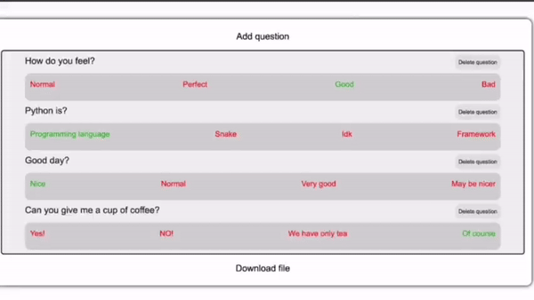

# Quizizz Telegram Bot


<p align="center">
  
  
</p>


---


## About
A ***two-part*** project

**Platform** - provides the ability to build a quiz on the site and get an output `.json` file with quiz info that the ***bot*** needs to start the quiz

**Bot** - provides access levels for *teacher* and *student*, *teacher* is able to upload `.json` files and start the quiz. At the time the *student* is able to take it

---
## Navigation
- [Installation](#installation)
- [Technologies Used](#technologies-used)
- [Project structure](#project-structure)
- [Figma and FigJam](#figma-and-figjam)
- [Documentation](#documentation)

---
## Installation
*Of course install [NodeJS](https://nodejs.org/en) previously


1. Clone the repository
```
git clone https://github.com/FeliksNovoselskyi/QuizizzBOT.git
```
2. Choose main directory of the project
3. Install packages
```
npm install
```
4. Create your own `.env` file in main directory

5. Write the information required for the **bot** and **platform** here as in the `.env-sample` file in main directory

6. Then choose what project do you wanna to start
### BOT
7. Choose `/bot`
```
cd bot
```

8. Create the `/uploaded_files` directory
(copies of the quiz files you upload as a *teacher* will be saved there)
```
mkdir uploaded_files
```

9. Run the project (run `index.js`)
```
node index.js
```

### PLATFORM
7. Choose `/platform`
```
cd platform
```

8. Run the project (run `server.js`)
```
node server.js
```

### Importantly
There is an `questions.json` file in the project directory

You can use it to create a quiz when the **bot** asks you to upload a `.json` file with the questions for the quiz

---
## Technologies Used
>[Back to top](#quizizz-telegram-bot)

| **Technology**  | **Description** |
| ------------- | -------------      |
| [NodeJS](https://nodejs.org/uk)       | The *main framework* on which the **bot** and the **platform** are built  |
| [Express](https://expressjs.com/)  | *Web framework* used to build the **platform**  |
| [JavaScript](https://developer.mozilla.org/en-US/docs/Web/JavaScript)  | The primary programming language  |
| [Sequelize ORM](https://sequelize.org/)  | **ORM** (Object-Relational Mapping) used for interacting with the database  |
| [node-telegram-bot-api](https://www.npmjs.com/package/node-telegram-bot-api)  | **API** used to develop a **Telegram bot**  |
| [EJS](https://ejs.co/)      | A simple templates language used for developing *website templates* |
| [jQuery](https://jquery.com/)                                                  | A **JavaScript** library that simplifies development and interaction within the project.                              |
| [Sortable](https://jqueryui.com/sortable/)                                     | A **jQuery** plugin that allows smooth and quick drag-and-drop *functionality* for reordering items.                    |
| [AJAX](https://api.jquery.com/category/ajax/)                                  | A technology for fast and convenient data handling without page refreshes.                                        |
| [Fetch API](https://developer.mozilla.org/en-US/docs/Web/API/Fetch_API)        | Used for asynchronous operations on the site without constant page refreshes.                                     |
| [HTML](https://developer.mozilla.org/en-US/docs/Web/HTML)/[CSS](https://developer.mozilla.org/en-US/docs/Learn/CSS) | Languages used for *website* layout, *structure*, and *styling*.                   |
| [Bootstrap 5](https://getbootstrap.com/)                                       | A ***frontend framework*** used to create various elements on the pages.                                                |
| [Figma](https://help.figma.com/hc/en-us)                                       | An online service used for designing the site's layout.                                                           |
| [SQLite3](https://www.sqlite.org/docs.html)                                    | A database used for site development.                                                                             |

---
## Project structure
>[Back to top](#quizizz-telegram-bot)


---
## Figma and FigJam
>[Back to top](#quizizz-telegram-bot)

Here are links to Figma and FigJam

In FigJam - there is a complete project plan and its functioning, in the form of a scheme
In Figma you can find the design project of the platform

* [Figma](https://www.figma.com/design/jMjdkaAEDIh5ONLtelxzi7/QuizizzBOT-Platform?node-id=0-1&t=Y2RKr0VkKNAYPncM-1)
* [FigJam](https://www.figma.com/board/AZD4TR2pNnDRlWKSJgVxKp/QuizizzBOT-Structure?node-id=0-1&t=FxYQlPNAcjUQaIe8-1)


---
## Documentation
>[Back to top](#quizizz-telegram-bot)

- [For platform](#for-platform)
- [For bot](#for-bot)
- [End of documentation](#end-of-documentation)

Full-fledged documentation for the project, contains introductory information for further acquaintance and work on the project for other developers

---
### For platform
- [DB functionality](#platform-db-functionality)
- [Server part](#server-part)
- [`/templates` directory](#directories-templates)
- [`/static` directory](#static)
- [`/fetch_api` directory](#the-last-thing-left-in-the-static-directory-is-the-fetch_api)


First of all, we familiarize ourselves with the structure of the database, **platform models**

In the **platform's** file system, there is a `/db` directory (as well as in the **bot's** file system)

A database will be created in the `/db` directory, with the name you specify in the `.env` file (fill it according to the example in `.env-sample`)

In the database, you will be able to track:
- Adding test questions
- Deleting questions
- Changing their order

And so, let's move on to the files

---
#### Platform DB functionality
>[Back to top](#quizizz-telegram-bot)

>[Back to top of the documentation](#documentation)

Let's get started
##### File `dbSetup.js`:
```javascript
import {Sequelize} from 'sequelize'
import dotenv from 'dotenv'

import {fileURLToPath} from 'url'
import {dirname, join} from 'path'


dotenv.config({path: '../.env'})

const __filename = fileURLToPath(import.meta.url)
const __dirname = dirname(__filename)

// Create an instance of the Sequelize class, which will be an ORM, to work with the db
export const sequelize = new Sequelize(process.env.PLATFORM_DB_NAME, process.env.PLATFORM_DB_ADMIN_NAME, process.env.PLATFORM_DB_PASSWORD, {
    host: 'localhost',
    dialect: 'sqlite',
    storage: join(__dirname, `${process.env.PLATFORM_DB_NAME}.db`)
})

// Sync DB
sequelize.sync()
    .then(() => {
        console.log('Database created successfully')
    })
    .catch((error) => {
        console.log('Error during creating database:', error)
    })
```

This file *prepares the database* for further use and *synchronizes* it

**[Sequelize ORM](https://sequelize.org/)** is used

The data required to create the database is uploaded from the `.env` file, such as:
- *Database Name*
- *Database administrator name*
- *Database password*

Traditionally, as in all *project files*, there are comments, sometimes short and clear, sometimes clearly described in detail
All for the sake of convenience of further use and *development*, as well as simple and qualitative familiarization with the project code

Let's move on

##### File `models.js`:
```javascript
import {DataTypes} from 'sequelize'

// My scripts
import * as dataBase from './dbSetup.js'

// Questions model
export const Questions = dataBase.sequelize.define('Questions', {
    id: {
        type: DataTypes.INTEGER,
        autoIncrement: true,
        primaryKey: true
    },
    questionText: {type: DataTypes.STRING},
    answer1: {type: DataTypes.STRING},
    answer2: {type: DataTypes.STRING},
    answer3: {type: DataTypes.STRING},
    answer4: {type: DataTypes.STRING},
    correctAnswer: {type: DataTypes.INTEGER},
    order: {type: DataTypes.INTEGER, defaultValue: 0}
})
```

A file containing absolutely all the *models* for the **platform** database

Let's move on to the rest of the **platform** structure:
- `server.js`
- `/templates`
- `/static`

---
#### Server part
>[Back to top](#quizizz-telegram-bot)

>[Back to top of the documentation](#documentation)

##### File `server.js`:
```javascript
import express from 'express'
import dotenv from 'dotenv'
import csrf from "csurf"
import cookieParser from 'cookie-parser'

import {fileURLToPath} from 'url'
import {dirname, join} from 'path'

// My scripts
import * as models from './db/models.js'

dotenv.config({path: '../.env'})

const app = express()

// PORT and HOST (from .env file or basic values)
const PORT = process.env.PORT || 3000
const HOST = process.env.HOST || 'localhost'

const __filename = fileURLToPath(import.meta.url)
const __dirname = dirname(__filename)

app.set('view engine', 'ejs')
app.set('views', './templates')

// Setup static routes
app.use('/static/', express.static(join(__dirname, 'static')))
app.use('/css', express.static(join(__dirname, 'node_modules/bootstrap/dist/css')))
app.use('/js', express.static(join(__dirname, 'node_modules/bootstrap/dist/js')))
app.use('/js', express.static(join(__dirname, 'node_modules/jquery/dist')))

app.use(express.urlencoded({extended: true}))
app.use(express.json()) // for json parsing after ajax requests

// CSRF protection
app.use(cookieParser())

const csrfProtection = csrf({cookie: true})
app.use(csrfProtection)

app.use((req, res, next) => {
    res.locals.csrfToken = req.csrfToken()
    next()
})

let context = {}

// Render of the main page
app.get('/', async (req, res) => {
    context.error = null

    // Preparing questions in their order (in ascending order)
    const allQuestions = await models.Questions.findAll({
        order: [['order', 'ASC']]
    })
    const questionData = allQuestions.map(question => question.dataValues)
    context.questionData = questionData

    res.render('main', context)
})

// Post requests on main page
app.post('/', csrfProtection, async (req, res) => {
    context = {}

    const {
        questionTextInput, 
        answer1Input, 
        answer2Input, 
        answer3Input, 
        answer4Input, 
        correctAnswerIndex, 
        action, 
        cell_order
    } = req.body

    if (action === "createQuest") {
        if (!questionTextInput || !answer1Input || !answer2Input || !answer3Input || !answer4Input) {
            // Unfilled inputs during creation of question
            // response to ajax
            return res.status(400).json({error: 'Fill all inputs to create a question'})
        } else if (correctAnswerIndex == null) {
            return res.status(400).json({ error: 'Choose only one correct answer within the valid range (1-4)' })
        } else {
            const newQuestion = await models.Questions.create({
                questionText: questionTextInput,
                answer1: answer1Input,
                answer2: answer2Input,
                answer3: answer3Input,
                answer4: answer4Input,
                correctAnswer: correctAnswerIndex
            })

            // Successfully created question
            // response to ajax
            return res.status(200).json({
                id: newQuestion.id,
                questionText: questionTextInput,
                answer1: answer1Input,
                answer2: answer2Input,
                answer3: answer3Input,
                answer4: answer4Input,
                correctAnswer: correctAnswerIndex,
                message: 'Question added successfully!'
            })
        }
    }

    if (action === "deleteQuest") {
        // get questionId from the submitted form (from hidden input)
        const questionId = req.body.questionId

        // if the questionId was missed at the time of receipt
        if (!questionId) {
            return res.status(400).json({error: 'Question ID is missing'})
        }

        // Trying to delete question from db
        try {
            await models.Questions.destroy({
                where: {id: questionId}
            })

            // Successfully deleted question
            return res.status(200).json({deleteQuestion: true})
        } catch (error) {
            console.error(error)

            // Probably errors during question deleting
            return res.status(400).json({error: 'Failed to delete question'})
        }
    }

    // If the item order (in this case, QUESTIONS) has been updated
    if (action === "cellOrderUpgrade") {
        for (const item_order of cell_order) {
            await models.Questions.update(
                {order: item_order.order},
                {
                    where: {id: item_order.id}
                }
            )
        }
    }

    // If a teacher wants a .json file of questions
    if (action === "downloadFile") {
        try {
            // Receiving questions in the order they appear in the db
            const questions = await models.Questions.findAll({
                order: [['order', 'ASC']]
            })

            // Creates an object with an array of questions, converting data from the database into a format suitable for JSON
            const questionsData = {
                questions: questions.map((q) => ({
                    question: q.questionText,
                    options: [q.answer1, q.answer2, q.answer3, q.answer4],
                    correct: q.correctAnswer
                }))
            }

            // Sets the content type as JSON so that the browser knows it is JSON data
            const jsonContent = JSON.stringify(questionsData, null, 2)

            // Sets the header to prompt the browser to download a file named “questions.json”
            // Sets the content type as JSON so that the browser knows it is JSON data
            res.setHeader('Content-Disposition', 'attachment; filename="questions.json"')
            res.setHeader('Content-Type', 'application/json')

            // Sends JSON data to the client (for downloading)
            res.send(jsonContent)
        } catch (error) {
            console.log("Error when creating JSON file", error)
            res.status(500).json({error: "Failed to create JSON file"})
        }
    }
})

// Url output for the site (for convenience during development)
app.listen(PORT, HOST, () => {
    console.log(`Server started on http://${HOST}:${PORT}`)
})
```

**Platform** core file, server side using server-side **[JavaScript](https://developer.mozilla.org/en-US/docs/Web/JavaScript)**

**[Express](https://expressjs.com/)** is used, basic protection against **CSRF-attacks** is connected

This file accepts requests from the **frontend** part and responds to them, which makes the **platform** fast and easy to use

Here such events as:
- *Question creation*
- *Question deletions*
- *Error handling*
- *Changing the order* of questions
- *Uploading a `.json`* file with questions for the quiz

There are extensive comments that will make it easier and faster to understand the code of the `server.js` file

---
#### Directories (`/templates`)
>[Back to top](#quizizz-telegram-bot)

>[Back to top of the documentation](#documentation)

The `/templates` directory contains these project templates:
- `main.ejs`

As you can see, a simple templates language **[EJS](https://ejs.co/)** is used for templates.

`main.ejs` - file in which the main project template is stored, with the necessary blocks for it

#### `/static`
The `/static` directory contains directories such as:
- `/css`
- `/js`

`/css` - directory with style files
`/js` - directory with `.js` files that provide comfortable use of the client part for the user

Let's break down `/js` in more detail:
- `/fetch_api` - (directory) option to use **[Fetch API](https://developer.mozilla.org/en-US/docs/Web/API/Fetch_API)** instead of **[AJAX](https://api.jquery.com/category/ajax/)** and **[jQuery](https://jquery.com/)**
- `createQuest.js` - creating a question
- `deleteQuest.js` - deleting a question
- `fileDownloading.js` - unload `.json` file
- `preloadScreen.js` - loading screen
- `sortableElements.js` - sorting questions on the page

---


##### File `createQuest.js`:
```javascript
$(document).ready(function() {
    $('.correct-answer-checkbox').change(function() {
        // If the current checkbox is selected, deselect all other checkboxes
        if ($(this).prop('checked')) {
            $('.correct-answer-checkbox').not(this).prop('checked', false)
        }
    })

    // Create question ajax request
    $(".question-form").submit(function(event) {
        event.preventDefault()

        const questionTextInput = $('#questionTextInput').val()
        const answer1Input = $('#answer1Input').val()
        const answer2Input = $('#answer2Input').val()
        const answer3Input = $('#answer3Input').val()
        const answer4Input = $('#answer4Input').val()

        const checkboxAnswers = [
            $('#correctAnswer1Input'),
            $('#correctAnswer2Input'),
            $('#correctAnswer3Input'),
            $('#correctAnswer4Input')
        ]

        function chooseCorrectAnswer() {
            const correctAnswers = checkboxAnswers.filter(checkbox => checkbox.prop('checked'))

            if (correctAnswers.length === 1) {
                const correctAnswerIndex = checkboxAnswers.indexOf(correctAnswers[0])
                return correctAnswerIndex
            }
            return null
        }

        const correctAnswerIndex = chooseCorrectAnswer()
        const csrfToken = $('meta[name="csrf-token"]').attr('content')

        $.ajax({
            url: '/',
            type: 'POST',
            headers: {
                'X-CSRF-Token': csrfToken,
            },
            contentType: 'application/json',
            data: JSON.stringify({
                questionTextInput,
                answer1Input,
                answer2Input,
                answer3Input,
                answer4Input,
                correctAnswerIndex,
                action: 'createQuest'
            }),
            success: function(response) {
                function getCorrectAnswer(index) {
                    if (response.correctAnswer === index) {
                        return 'corr-answer'
                    } else {
                        return 'incorr-answer'
                    }
                }

                const newQuestionHtml = `
                    <div class="question" data-question-id="${response.id}">
                        <div class="question-header">
                            <h3 class="question-text">${response.questionText}</h3>
                            <form action="/" method="post" class="delete-quest-form">
                                <input type="hidden" name="questionId" value="${response.id}">
                                <button type="submit" class="delete-quest-button" name="action" value="deleteQuest" data-question-id="${response.id}">Delete question</button>
                            </form>
                        </div>
                        <div class="answers">
                            

                            <p class="answers-text ${getCorrectAnswer(0)}">${response.answer1}</p>
                            <p class="answers-text ${getCorrectAnswer(1)}">${response.answer2}</p>
                            <p class="answers-text ${getCorrectAnswer(2)}">${response.answer3}</p>
                            <p class="answers-text ${getCorrectAnswer(3)}">${response.answer4}</p>
                        </div>
                    </div>
                `
                // Add new question on page
                $('#created-questions').append(newQuestionHtml)

                // Clear error message and reset form inputs
                $('.error-message').text("")
                $('.question-form')[0].reset()
            },

            error: function(response) {
                if (response.status === 400) {
                    $('.error-message').text(response.responseJSON.error)
                }
            }
        })
    })
})
```

In this file, an asynchronous request is sent to the server when adding a question, in order to speed up the site, and also to avoid regular reloading of the site at each action
The above mentioned technologies are used here:
- **[AJAX](https://api.jquery.com/category/ajax/)**
- **[jQuery](https://jquery.com/)**

---


##### File `deleteQuest.js`:
```javascript
$(document).ready(function() {
    // Delegation of events
    // to be able to handle events of dynamically added elements
    $(document).on('submit', '.delete-quest-form', function(event) {
        event.preventDefault()

        // Get form using jQuery for correctly questions deleting
        let $form = $(this)
        let questionId = $form.find("input[name=questionId]").val()

        const csrfToken = $('meta[name="csrf-token"]').attr('content')

        $.ajax({
            url: '/',
            type: 'POST',
            headers: {
                'X-CSRF-Token': csrfToken,
            },
            contentType: 'application/json',
            data: JSON.stringify({
                questionId,
                action: 'deleteQuest'
            }),
            success: function(response) {
                if (response.deleteQuestion) {
                    // Deleting .question div where the delete button
                    $form.closest('.question').remove()
                }
            },
            error: function(response) {
                console.log(response.responseJSON.error)
            }
        })
    })
})
```

Similarly, allows you to delete questions asynchronously and without reloading the page, both on the page and in the database, which is logical
The technologies used are similar
Also connected protection from **CSRF-attacks** as in other static files from the `/static` directory

---


##### File `fileDownloading.js`:
```javascript
$(document).ready(function() {
    // Process a button click to load a .json file with test questions
    // in order to upload this file to chat with the bot in the future
    $(document).on('submit', '#download-form', function(event) {
        event.preventDefault()

        const csrfToken = $('meta[name="csrf-token"]').attr('content')

        $.ajax({
            url: '/',
            type: 'POST',
            headers: {
                'X-CSRF-Token': csrfToken,
            },
            contentType: 'application/json',
            data: JSON.stringify({
                action: 'downloadFile'
            }),
            success: function(response) {
                // Converts a response object to formatted JSON with indentation
                const jsonString = JSON.stringify(response, null, 2)

                // Creating a page link element
                // Putting a link in it that will prompt you to select a location
                // in the computer's file system
                const link = document.createElement('a')
                link.href = 'data:application/json;charset=utf-8,' + encodeURIComponent(jsonString)
                link.download = 'questions.json'

                // Simulate clicking on a newly created link to instantly download a file
                document.body.appendChild(link)
                link.click()
                document.body.removeChild(link)
            }
        })
    })
})
```

The file provides convenient and fast `.json` uploading at the moment when the teacher needs it

After clicking on the button to upload `.json` file, on the server the necessary information is collected from the database and formed into a `.json` file, this file will be sent by the **teacher** to the **bot** personally to process it and the teacher can run the quiz for his students

On the client side, a temporary link is formed, when you click on it, it opens a window of your computer's file system:
- **macOS** - Finder
- **Windows** - Explorer

Then you choose a convenient place on your computer to save the new file

The technologies used are similar

---


##### File `preloadScreen.js`:
```javascript
window.addEventListener("load", () => {
    const loadingScreen = document.querySelector("#loading-screen")
    const content = document.querySelector("main")
    
    loadingScreen.style.display = "none"
    content.style.display = "block"
})
```

As you can see, a compact file
Participates in the work of a beautiful and minimalistic loading screen for the **platform**, to brighten up your wait for loading the site if you have a weak computer)))))
Well, or, it is heavily loaded with other processes

The basic **DOM-tree**, its *methods*, and `css` *styles* are used

---


##### File `sortableElements.js`:
The last file in this directory
```javascript
$(document).ready(function () {
    const $questions = $("#created-questions")

    function sortingElements($container, dataAttr) {
        // Check if there are elements that can be sorted
        if ($container.length) {
            new Sortable($container[0], {
                animation: 150,
                onEnd: function () {
                    const order = []
                    const containerCells = $container.children()
                    
                    // Prepare order before being sent to the server
                    containerCells.each(function (index) {
                        const cellId = $(this).data(dataAttr)
                        order.push({
                            id: cellId,
                            order: index + 1
                        })
                    })
    
                    const csrfToken = $('meta[name="csrf-token"]').attr('content')
                    
                    $.ajax({
                        url: "/",
                        type: "POST",
                        headers: {
                            'X-CSRF-Token': csrfToken,
                        },
                        contentType: 'application/json',
                        data: JSON.stringify({
                            cell_order: order,
                            action: "cellOrderUpgrade",
                        })
                    })
                }
            })
        }
    }

    sortingElements(
        $container=$questions,
        dataAttr="question-id"
    )
})
```

Used for smooth, and most importantly beautiful change of the order of questions in the interface of the site
There is a function that allows you to compactly sort and other groups of elements on the site

Used such technologies as:
- **[jQuery](https://jquery.com/)**
- **[Sortable](https://jqueryui.com/sortable/)**
- **[AJAX](https://api.jquery.com/category/ajax/)**

The new order of questions, which are displayed on the page after dragging and dropping them, will be processed and saved in the database
That will allow to save the order of questions after page refresh, as well as to place them in the necessary order in the generated `.json` file when uploading it

---
#### The last thing left in the `/static` directory is the `/fetch_api`
>[Back to top](#quizizz-telegram-bot)

>[Back to top of the documentation](#documentation)

What it consists of:
- `createQuestFetch.js`
- `deleteQuestFetch.js`

These files perform similar functionality to the `createQuest.js` and `deleteQuest.js` files
However, the **[Fetch API](https://developer.mozilla.org/en-US/docs/Web/API/Fetch_API)** is used here

---


##### File `createQuestFetch.js`:
```javascript
$(document).ready(function() {
    $('.correct-answer-checkbox').change(function() {
        // If the current checkbox is selected, deselect all other checkboxes
        if ($(this).prop('checked')) {
            $('.correct-answer-checkbox').not(this).prop('checked', false)
        }
    })

    // Create question ajax request
    $(".question-form").submit(function(event) {
        event.preventDefault()

        // Get form input values
        // using jQuery
        const questionTextInput = $('#questionTextInput').val()
        const answer1Input = $('#answer1Input').val()
        const answer2Input = $('#answer2Input').val()
        const answer3Input = $('#answer3Input').val()
        const answer4Input = $('#answer4Input').val()

        const checkboxAnswers = [
            $('#correctAnswer1Input'),
            $('#correctAnswer2Input'),
            $('#correctAnswer3Input'),
            $('#correctAnswer4Input')
        ]

        function chooseCorrectAnswer() {
            const correctAnswers = checkboxAnswers.filter(checkbox => checkbox.prop('checked'))

            if (correctAnswers.length === 1) {
                const correctAnswerIndex = checkboxAnswers.indexOf(correctAnswers[0])
                return correctAnswerIndex
            }
            return null
        }

        const correctAnswerIndex = chooseCorrectAnswer()

        fetch('/', {
            method: 'POST',
            headers: {
                'Content-Type': 'application/json'
            },
            body: JSON.stringify({
                questionTextInput,
                answer1Input,
                answer2Input,
                answer3Input,
                answer4Input,
                correctAnswerIndex,
                action: 'createQuest'
            })
        })
        .then(response => {
            if (!response.ok) {
                throw response
            }
            return response.json()
        })
        // Successfully created question
        .then(data => {
            const newQuestionHtml = `
                <div class="question">
                    <div class="question-header">
                        <h3 class="question-text">${data.questionText}</h3>
                        <form action="/" method="post" class="delete-quest-form">
                            <input type="hidden" name="questionId" value="${data.id}">
                            <button type="submit" class="delete-quest-button" name="action" value="deleteQuest" data-question-id="${data.id}">Delete question</button>
                        </form>
                    </div>
                    <div class="answers">
                        <p class="answers-text">${data.answer1}</p>
                        <p class="answers-text">${data.answer2}</p>
                        <p class="answers-text">${data.answer3}</p>
                        <p class="answers-text">${data.answer4}</p>
                    </div>
                </div>
            `

            // Add new question on page
            // insertAdjacentHTML method is used to correctly add new code
            // using dom-tree
            document.getElementById('created-questions').insertAdjacentHTML('beforeend', newQuestionHtml)
            
            // Clear error message and reset form inputs
            document.querySelector('.error-message').textContent = ""
            document.querySelector('.question-form').reset()
        })
        // Errors during form validation
        .catch(error => {
            // Check if error is an instance of Response class
            // It is checked to ensure that the request has been sent, even if it is not correct
            if (error instanceof Response) {
                error.json().then(err => {
                    document.querySelector('.error-message').textContent = err.error
                })
            } else {
                console.error(error)
            }
        })
    })
})

// Response.json() takes the Response stream and reads it to the end
// It returns a promise that resolves to the result of parsing the response body as a string
```

It is used for what its counterpart - *asynchronous* question creation, is also used for
Check out the comments, and if you have ideas on how to improve this part of the project, I'd love to see your suggestions in the form of a **Pull Request**!

---


##### File `deleteQuestFetch.js`:
```javascript
$(document).ready(function() {
    // Delegation of events
    // to be able to handle events of dynamically added elements
    $(document).on('submit', '.delete-quest-form', function(event) {
        event.preventDefault()

        // Get form using jQuery for correctly questions deleting
        let $form = $(this)
        let questionId = $form.find("input[name=questionId]").val()

        fetch('/', {
            method: 'POST',
            headers: {
                'Content-Type': 'application/json'
            },
            body: JSON.stringify({
                questionId,
                action: 'deleteQuest'
            })
        })
        .then(response => {
            if (!response.ok) {
                throw response
            }
            return response.json()
        })
        // Successfully deleted question
        .then(data => {
            if (data.deleteQuestion) {
                $form.closest('.question').remove()
            }
        })

        // Possible errors
        .catch(error => {
            // Check if error is an instance of Response class
            // It is checked to ensure that the request has been sent, even if it is not correct
            if (error instanceof Response) {
                error.json().then(err => {
                    console.error(err.error)
                })
            }
        })
    })
})

// Response.json() takes the Response stream and reads it to the end
// It returns a promise that resolves to the result of parsing the response body as a string
```

File deletion, using the same technology
Read the comments to familiarize yourself, if you have additional questions, contact me at my **[GitHub Profile](https://github.com/FeliksNovoselskyi)**

These files provide an alternative for those developers who are either not familiar with **[jQuery](https://jquery.com/)** and **[AJAX](https://api.jquery.com/category/ajax/)** at all, or you're just more used to **[Fetch API](https://developer.mozilla.org/en-US/docs/Web/API/Fetch_API)**

If I have time, in the future I will try to make an alternative on **[Fetch API](https://developer.mozilla.org/en-US/docs/Web/API/Fetch_API)** and for the rest of the *client part*, and also, to finalize these files

And you will have an opportunity to work on this project with more familiar and familiar technology, if you are interested in it, of course

---
### For bot
>[Back to top](#quizizz-telegram-bot)

>[Back to top of the documentation](#documentation)

- [BOT DB functionality](#bot-db-functionality)
- [Main bot files](#main-bot-files)
- [Modules directory](#modules-directory)

Documentation of the **bot**, I think we should start with its models
In the **bot's** directory there is a `/db` directory
Let's have a look at its contents:
- `dbFunctions.js`
- `dbSetup.js`
- `models.js`.

The `dbFunctions.js` file is present here, unlike in the **platform**, because in the **Telegram bot** some operations with the database were repeated, because of which, it was decided to put some functions in a separate file for convenience

As you can see, the structure that ensures the operation of the database is very similar to the same structure for the **platform**, this is done on purpose, so that the structure of projects was maximally similar, simple, and most importantly understandable

Let's analyze each file in this directory separately

#### BOT DB functionality
>[Back to top](#quizizz-telegram-bot)

>[Back to top of the documentation](#documentation)

File `dbSetup.js`:
```javascript
import {Sequelize} from 'sequelize'
import dotenv from 'dotenv'

import {fileURLToPath} from 'url'
import {dirname, join} from 'path'

dotenv.config({path: '../.env'})

const __filename = fileURLToPath(import.meta.url)
const __dirname = dirname(__filename)

// Create an instance of the Sequelize class, which will be an ORM, to work with the db
export const sequelize = new Sequelize(process.env.BOT_DB_NAME, process.env.BOT_DB_ADMIN_NAME, process.env.BOT_DB_PASSWORD, {
    host: 'localhost',
    dialect: 'sqlite',
    storage: join(__dirname, `${process.env.BOT_DB_NAME}.db`)
})

// Sync BOT DB
sequelize.sync()
    .then(() => {
        console.log('Database created successfully')
    })
    .catch((error) => {
        console.log('Error during database creation:', error)
    })
```

This file configures, creates and synchronizes the database, using the familiar **[Sequelize ORM](https://sequelize.org/)**

The values needed for the database, such as:
- *Database Administrator Name*
- *Database Password*
- *Database Name*

Similarly with the **platform**, taken from the `.env` file

File `models.js`:
```javascript
import {DataTypes} from 'sequelize'

// My scripts
import * as dataBase from './dbSetup.js'

// Users model
export const Users = dataBase.sequelize.define('Users', {
    userId: {type: DataTypes.INTEGER},
    username: {type: DataTypes.TEXT},
    firstName: {type: DataTypes.TEXT},
    lastName: {type: DataTypes.TEXT},
    role: {type: DataTypes.TEXT},
    progress: {type: DataTypes.TEXT}
})
```

This file contains models for the **bot**, for example, the `Users` model, which stores such information about users:
- `userId` - primary key of the user from *Telegram* itself
- `username` - full user name
- `firstName` - user's first name
- `lastName` - user's last name
- `role` - user's role for the **bot** (*teacher* or *student*)
- `progress` - user's progress after passing the quiz

Finally, the fun part, let's go to the `dbFunctions.js` file

File `dbFunctions.js`:
```javascript
// My scripts
import * as models from './models.js'

// Function in which user information is added to the database
export async function addUser(userId, username, firstName, lastName, role) {
    try {
        models.Users.create({
            userId: userId,
            username: username,
            firstName: firstName,
            lastName: lastName,
            role: role,
        })
    } catch (error) {
        console.error('Error adding a user:', error.message)
    }
}

// Function to get information about the user when he/she wants it
export async function getUserById(userId) {
    try {
        const user = await models.Users.findOne({where: {userId}})
        return user
    } catch (error) {
        console.error('Error when receiving a user:', error.message)
        return null
    }
}

// Function updating the user role in the database
// depending on the one he's got now
export async function updateUserRole(userId, newRole, callback) {
    try {
        const [updated] = await models.Users.update({role: newRole}, {where: {userId}})
        
        if (updated) {
            callback()
        } else {
            console.error("Error: user with this id was not found")
        }
    } catch (error) {
        console.error("Error updating a role:", error.message)
    }
}

// Function that updates the user's progress
export async function updateProgress(newList, userId) {
    try {
        await models.Users.update({progress: newList}, {where: {userId}})
    } catch (error) {
        console.error("Error when updating user progress:", error.message)
    }
}


// Function to clearing user progress from the database
export async function clearProgress(userId) {
    try {
        await models.Users.update({progress: null}, {where: {userId}})
    } catch (error) {
        console.error("Error during clearing progress", error.message)
    }
}
```

As you can see, there are quite a lot of functions in this file, which are used in almost all pieces of code for the **bot**
It was possible to use already existing methods, but creating your own functions allowed you to add ***logging***, for additional checks of the code and with the database specifically
At the same time getting a more detailed description of errors, which **[NodeJS](https://nodejs.org/uk)** has quite big problems with

In short, the point of the file is to improve the existing methods in **[Sequelize ORM](https://sequelize.org/)**, while gathering them in one place and giving a more detailed description of each of them

As always, there are comments in the code, which will help you to understand the project, and if you want to make your own changes, which I will be extremely glad and grateful to you

#### Main bot files
>[Back to top](#quizizz-telegram-bot)

>[Back to top of the documentation](#documentation)

Now, let's move on to the main **bot** files:
- `index.js` - the main **bot** file, where all its processes are managed
- `config.js` - **bot** configuration, its main variables and constants
- `questions.json` - an example `.json` file to run a quiz

These files are located in the main **bot** directory

Let's start with the main file, `index.js`
File `index.js`:
```javascript
// My scripts
import {
    bot, 
    completedQuizzes, 
    canStart, 
    addedFile, 
    isTeacherLogin, 
    helpMessage,
    allQuestions,
    __dirname
} from "./config.js"
import handleCallbackQuery from './modules/callbackHandlers.js'
import handleFileUpload from './modules/filesHandlers.js'

import * as dbFunctions from './db/dbFunctions.js'

import * as quizFuncs from './modules/quizFunctional.js'
import * as botFuncs from './modules/botFunctions.js'

// Create a menu of commands for the bot
bot.setMyCommands([
    {command: '/start', description: '❕ Start communicating with the bot'},
    {command: '/help', description: '❕ Get help from the bot'},
    {command: '/info', description: '❕ Get information about you'},
    {command: '/change_role', description: '❕ Change your role'},
    {command: '/can_start_quiz', description: '❕ Provide an opportunity to take the quiz (teacher)'},
    {command: '/quiz', description: '❕ Start taking the quiz if given the opportunity to do so (student)'},
])

// User messages
bot.on('message', async function(message) {
    const chatId = message.chat.id
    const userId = message.from.id
    const messageId = message.message_id

    // If a user has written /start we get data about him/her
    // whether it is stored in the database or not
    if (message.text === '/start') {
        dbFunctions.getUserById(userId).then(async (user) => {
            if (user) {
                await bot.sendMessage(chatId, `Hi! 👋\nYou are already registered with this bot as ${user.role}`)
            } else {
                const startOptions = {
                    reply_markup: {
                        inline_keyboard: [
                            [{text: '🧑‍🎓 Register as a student', callback_data: 'register_student'}],
                            [{text: '👨‍🏫 Log in as a teacher', callback_data: 'login_teacher'}],
                        ],
                    },
                }
        
                await bot.sendMessage(chatId, 'Hello! 👋\nYou can sign up for this bot as a student 🧑‍🎓 or log in as a teacher 👨‍🏫 to create quizzes! \n❕ Find out your status: /info', startOptions)
            }
        })
    }

    // If the user wants to retrieve data about him/herself
    if (message.text === '/info')  {
        dbFunctions.getUserById(userId).then(async (user) => {
            if (user) {
                await bot.sendMessage(chatId, `👉 Your first and last names: ${user.firstName} ${user.lastName} \n👉 Your status: ${user.role}`)
            } else {
                await bot.sendMessage(chatId, '😓 You are not logged into this bot')
            }
        })
    }

    // If the user wants to take help with bot commands
    if (message.text === '/help')  {
        await bot.sendMessage(chatId, helpMessage)
    }

    // Command to change role
    if (message.text === '/change_role')  {
        dbFunctions.getUserById(userId).then(async (user) => {

            if (user) {
                botFuncs.checkUserRole(userId, chatId)
            } else {
                await bot.sendMessage(chatId, '❗️ You are not logged into this bot! ❗️')
            }
        })
    }

    // If the user wants to start taking the quiz
    if (message.text === '/quiz') {
        dbFunctions.getUserById(userId).then(async (user) => {
            if (user.role === 'student' && canStart.canStartQuiz && !completedQuizzes[chatId]) {
                await dbFunctions.clearProgress(userId)

                // Resetting the question index for a user
                quizFuncs.userQuestions[chatId] = 0
                await quizFuncs.sendQuestion(chatId, messageId)
            } else {
                await bot.sendMessage(chatId, '❗️ Passing the quiz is not allowed!\n❗️ Or, if you are a teacher, you cannot take the quiz')
            }
        })
    }

    // Command authorizing to start the quiz (available only to the teacher)
    if (message.text === '/can_start_quiz') {
        dbFunctions.getUserById(userId).then(async (user) => {
            if (user.role === 'teacher') {
                if (addedFile.addedJsonFile) {
                    canStart.canStartQuiz = true
                    completedQuizzes[chatId] = false
                    bot.sendMessage(chatId, '🔥👍 You have successfully created a quiz!\n🤔 Now your students can start quiz with command /quiz')
                } else {
                    bot.sendMessage(chatId, '❗️ You did not upload a .json file with questions ❗️')
                }
            } else {
                await bot.sendMessage(chatId, '❗️ Only the teacher has the right to start the quiz ❗️')
            }
        })
    }

    // Handling the condition when absolutely any message has been written
    // in this case, help for the user will be displayed
    if (
    !message.document &&
    !isTeacherLogin.isLogin &&
    message.text !== '/start' &&
    message.text !== '/info' &&
    message.text !== '/help' &&
    message.text !== '/change_role' &&
    message.text !== '/quiz' &&
    message.text !== '/can_start_quiz'
        ) {
        await bot.sendMessage(chatId, helpMessage)
    }
})

// Callbacks handling
bot.on('callback_query', async function(query) {
    await handleCallbackQuery(
        query, 
        quizFuncs, 
        dbFunctions, 
        botFuncs
    )
})

// Files handling
bot.on('document', async function(message) {
    await handleFileUpload(
        dbFunctions,
        message
    )
})
```

The main file in the **bot's** structure, at the same time the largest one
This file manages all the processes of the **bot**, which also take place in other files

The main variables and constants from `config.js` are imported here, as well as functions from other modules

This is where it is processed:
- Commands
- Callback requests
- Document upload (basically, `.json` file with quiz)
- A universal menu for **bot** commands is set up

About the menu of commands, yes, it can be done through **BotFather**, but, in this case, the menu will be unique for a particular **bot**, and when cloning the project, this menu in your **bot** with your *token* will not be displayed
The menu of course takes extra space in the code, but makes the transition to work on the project more convenient, fast and comfortable

If you have additional questions about this and other files:
First of all, familiarize yourself with the comments
Second, contact me at my **[GitHub Profile](https://github.com/FeliksNovoselskyi)**

Let's move on

File `config.js`:
```javascript
import {dirname} from 'path'
import {fileURLToPath} from 'url'

import path from 'path'
import telegramApi from 'node-telegram-bot-api'
import dotenv from 'dotenv'

dotenv.config({path: '../.env'})

const __filename = fileURLToPath(import.meta.url)
export const __dirname = dirname(__filename)

const botToken = process.env.token
export const bot = new telegramApi(botToken, {polling: true})

// Get the directory where we will save json files sent by the user
export const uploadFilesDir = path.join(__dirname, 'uploaded_files')

// Variables for quiz functionality (quiz in one message)
export const answerMsgIdState = {
    answerMessageId: null
}
export const completedQuizzes = {}
export const jsonFileName = {}

// Flags
export const canStart = {
    canStartQuiz: false
}
export const addedFile = {
    addedJsonFile: false
}
export const isTeacherLogin = {
    isLogin: false
}

// Constant to which the questions will be written after parsing the file.json
export const allQuestions = {
    questions: {}
}

// Constant storing the text of the message with the result of the answer to the question
// is used when checking for a match between a new text and an existing text.
export const currentMessageText = {
    messageText: ""
}


// Bot message (only huge messages)
export let helpMessage = `
Hi! 👋🤘
Do you need some help? 🤔
Here's a list of my commands that can help you:

/start - starts your communication with me
/help - will give you a list of commands that can help you
/info - will give you information about yourself, your status, whether you are registered or not
/change_role - allows you to change your role, for example from student to teacher
/can_start_quiz - command that allows you to pass quiz. Available only to teacher 👨‍🏫
/quiz - command to start a quiz. Available only to the student 🧑‍🎓

Also remember that you always have a menu of my commands that can help you 🤗
`
```

A configuration file for the bot, which contains the main constants and variables that are exported and used in other bot modules in the future

The reason for the creation of the file was the overloading of `index.js`, because of which it was split into many files, which remain to this day

Likewise, extensive comments are present, giving you a chance to familiarize yourself with every point that is difficult to understand at a glance

Good luck!

Next, the last file in the main directory

File `questions.json`:
```json
{
    "questions": [
        {
            "question": "What language is used to develop with Node.js?",
            "options": ["Python", "C#", "JavaScript", "Ruby"],
            "correct": 2
        },
        {
            "question": "What is the name of the package manager for Node.js?",
            "options": ["npm", "pip", "composer", "gem"],
            "correct": 0
        },
        {
            "question": "What is an API?",
            "options": ["Data transfer protocol", "Versioning system", "Interface for application interaction", "Python module"],
            "correct": 2
        },
        {
            "question": "What method is used to output information to the console in JavaScript?",
            "options": ["print()", "echo()", "console.log()", "alert()"],
            "correct": 2
        },
        {
            "question": "What is a variable in programming?",
            "options": ["Fixed value", "Named container for saving data", "Data type", "System team"],
            "correct": 1
        },
        {
            "question": "What character is used to assign a value in JavaScript?",
            "options": ["==", "=", "=>", "==="],
            "correct": 1
        },
        {
            "question": "Which data type is primitive in JavaScript?",
            "options": ["Object", "Array", "Function", "String"],
            "correct": 3
        },
        {
            "question": "What does the ‘===’ operator do in JavaScript?",
            "options": ["Compares only the value of", "Compares types and values", "Compares object references", "Converts data types before comparing"],
            "correct": 1
        },
        {
            "question": "What function is used to convert a string to a number in JavaScript?",
            "options": ["Number()", "String()", "parseInt()", "float()"],
            "correct": 2
        },
        {
            "question": "What is DOM in web development?",
            "options": ["Markup language", "Software library", "Interface for working with HTML and XML documents", "A framework for JS"],
            "correct": 2
        }
    ]
}
```

This file is not used in other modules, or the functioning of the project as a whole
This is an example file that shows a sample `.json` file that will be sent to the **bot** to allow it to start your quiz

Added so that you can quickly grab an already built file that will serve as an example for the **bot** to work from

If you are interested in this, you can already create your own `.json`, but with the help of the **platform**, in a convenient and simple interface, instead of manually writing the code

I think it will be very convenient for you, as well as those with whom you can work on this project

#### Modules directory
>[Back to top](#quizizz-telegram-bot)

>[Back to top of the documentation](#documentation)

So, we have familiarized ourselves with the main part of the **bot's** file system
Now we can move on to the `/modules` directory

What `/modules` consists of:
- `botFunctions.js`
- `callbackHandlers.js`
- `filesHandlers.js`
- `quizFunctional.js`

These are the **bot's** service files, which provide the lion's share of its functionality, and are also designed to unload the main file, which is obviously more convenient when working on the project

---


File `botFunctions.js`:
```javascript
// My scripts
import * as dbFunctions from '../db/dbFunctions.js'

import {
    bot,
    isTeacherLogin
} from "../config.js"

// Function that handles login as a teacher, with password verification
export async function teacherLogin(chatId, messageId, userId, username, firstName, lastName, changeToTeacherRole) {
    await bot.sendMessage(chatId, '❕ Enter your teacher account password (password only, no extra characters)')

    const teacherPassword = process.env.teacherPassword
    bot.once('message', async (message) => {
        const userInputPassword = message.text

        // Checking the validity of the password entered by the user
        if (userInputPassword === teacherPassword) {
            await bot.editMessageReplyMarkup({inline_keyboard: []}, {chat_id: chatId, message_id: messageId})
            if (changeToTeacherRole) {
                // Role change from student to teacher
                dbFunctions.updateUserRole(userId, 'teacher', () => {
                    isTeacherLogin.isLogin = false
                    bot.sendMessage(chatId, "👨‍🏫 Your role has been changed to teacher! \n\n❕ Now you can upload a JSON file with your test questions, and give your students the opportunity to start the test with command /can_start_quiz!")
                })
                return
            }
            
            dbFunctions.addUser(userId, username, firstName, lastName, 'teacher')
            await bot.sendMessage(chatId, '👨‍🏫 You have successfully logged in as a teacher! \n❕ Now you can upload a JSON file with your test questions, and give your students the opportunity to start the test with command /can_start_quiz!')
        } else {
            await bot.sendMessage(chatId, '❗️ Incorrect password! \nTry again \nTo do this, press the login button again ❗️')
        }
    })
}

// Check the current user role
export function checkUserRole(userId, chatId) {
    dbFunctions.getUserById(userId).then(async (user) => {
        if (user) {
            if (user.role === 'student') {
                // If the current role is student, offer a change to teacher
                bot.sendMessage(chatId, "🧑‍🎓 You are logged in as a student. Would you like to log in as a teacher 👨‍🏫?", {
                    reply_markup: {
                        inline_keyboard: [
                            [{text: "Yes", callback_data: "switch_to_teacher"}],
                            [{text: "No", callback_data: "cancel_change_role"}]
                        ]
                    }
                })
            } else if (user.role === 'teacher') {
                // If the current role is teacher, offer a change to student
                bot.sendMessage(chatId, "👨‍🏫 You are logged in as a teacher. Would you like to log in as a student 🧑‍🎓?", {
                    reply_markup: {
                        inline_keyboard: [
                            [{text: "Yes", callback_data: "switch_to_student"}],
                            [{text: "No", callback_data: "cancel_change_role"}]
                        ]
                    }
                })
            }
        }
    })
}
```

This file contains some of the main functions of the bot, which are used in many cases, which simplifies the code and writing of the project
- `teacherLogin()`
- `checkUserRole()`

`teacherLogin()` - Logs the user in as a *teacher*, and checks if the user is already logged in (and accordingly tries to change his *role* to *teacher*), or creates an account immediately as a *teacher*

`checkUserRole()` - checks the user's *role* before offering to change it, so that if you are a *student*, you can successfully change your *role* to *teacher* (if you know the password, of course)
And being a *teacher*, you can become a *student*

The "`teacher` / `student`" functionality was created for this purpose:
- First of all for convenient testing of the project
- To get rid of the need to maintain 2 accounts in **Telegram**
- Allow users to change their *role*

As everywhere else, there are comments that will help you to understand the file code in detail in practice

---


File `callbackHandlers.js`:
```javascript
// My scripts
import {
    bot,
    allQuestions,
    answerMsgIdState,
    isTeacherLogin,
    currentMessageText,
    __dirname
} from "../config.js"

// Processing callback functions
// bot.on('callback_query', async function(query) {
export default async function handleCallbackQuery(query, quizFuncs, dbFunctions, botFuncs) {
    const chatId = query.message.chat.id
    const userId = query.from.id
    const messageId = query.message.message_id

    const username = query.from.username || ''
    const firstName = query.from.first_name || ''
    const lastName = query.from.last_name || ''

    const userIndex = quizFuncs.userQuestions[chatId] || 0
    const currentQuestion = allQuestions.questions[userIndex]

    // Sign up as a student
    if (query.data === 'register_student') {
        dbFunctions.addUser(userId, username, firstName, lastName, 'student')
        await bot.editMessageReplyMarkup({inline_keyboard: []}, {chat_id: chatId, message_id: messageId})
        await bot.sendMessage(chatId, '🧑‍🎓 You are registered in this bot as a student')
        return
    }

    // Sign in as a teacher
    if (query.data === 'login_teacher') {
        isTeacherLogin.isLogin = true
        botFuncs.teacherLogin(chatId, messageId, userId, username, firstName, lastName, false)
        return
    }

    // Role change from student to teacher
    if (query.data === 'switch_to_teacher') {
        isTeacherLogin.isLogin = true
        botFuncs.teacherLogin(chatId, messageId, userId, username, firstName, lastName, true)
        return
    } 
    
    if (query.data === 'switch_to_student') {
        // Role change from teacher to student
        delete quizFuncs.userQuestions[chatId]
        dbFunctions.updateUserRole(userId, 'student', () => {
            bot.sendMessage(chatId, "🧑‍🎓 Your role has been changed to student")
        })
        await bot.editMessageReplyMarkup({inline_keyboard: []}, {chat_id: chatId, message_id: messageId})
        return
    }
    
    if (query.data === 'cancel_change_role') {
        // Cancelling a role change
        await bot.sendMessage(chatId, "🤨 Role change cancelled")
        await bot.editMessageReplyMarkup({inline_keyboard: []}, {chat_id: chatId, message_id: messageId})
        return
    }

    // Check if there is no current issue, avoid executing the code
    if (!currentQuestion) {
        return // If there is no question, we don't do anything further
    }

    // Processing of responses to questions
    const answerIndex = parseInt(query.data)
    const isCorrect = answerIndex === currentQuestion.correct

    const numberQuestion = quizFuncs.userQuestions[userId]

    let questionResult = {}
    let userProgressJSON

    if (isCorrect) {
        const correctAnswerText = "✅ That's the right answer! ✅"
        
        questionResult[numberQuestion] = 1
        quizFuncs.userProgress.push(questionResult)

        // Determining whether a reply message has been sent or not
        // it's done by its message_id
        if (answerMsgIdState.answerMessageId) {
            // Check if the existing text matches the text that will be added
            // If they match, an error will occur
            if (currentMessageText.messageText !== correctAnswerText) {
                await bot.editMessageText(correctAnswerText, {
                    chat_id: chatId,
                    message_id: answerMsgIdState.answerMessageId
                })
                currentMessageText.messageText = correctAnswerText
            }
        } else {
            const sentMessage = await bot.sendMessage(chatId, correctAnswerText)
            answerMsgIdState.answerMessageId = sentMessage.message_id
            currentMessageText.messageText = correctAnswerText
        }
        
        userProgressJSON = JSON.stringify(quizFuncs.userProgress)
        dbFunctions.updateProgress(userProgressJSON, userId)
    } else {
        const wrongAnswerText = `❌ Wrong answer! The correct answer: ${currentQuestion.options[currentQuestion.correct]} ❌`
        
        questionResult[numberQuestion] = 0
        quizFuncs.userProgress.push(questionResult)

        // Determining whether a reply message has been sent or not
        // it's done by its message_id
        if (answerMsgIdState.answerMessageId) {
            // Check if the existing text matches the text that will be added
            // If they match, an error will occur
            if (currentMessageText.messageText !== wrongAnswerText) {
                await bot.editMessageText(wrongAnswerText, {
                    chat_id: chatId,
                    message_id: answerMsgIdState.answerMessageId
                })
                currentMessageText.messageText = wrongAnswerText
            }
        } else {
            const sentMessage = await bot.sendMessage(chatId, wrongAnswerText)
            answerMsgIdState.answerMessageId = sentMessage.message_id
            currentMessageText.messageText = wrongAnswerText
        }
        
        userProgressJSON = JSON.stringify(quizFuncs.userProgress)
        dbFunctions.updateProgress(userProgressJSON, userId)
    } 
    

    await bot.editMessageReplyMarkup({inline_keyboard: []}, {chat_id: chatId, message_id: messageId})

    // Moving on to the next question
    quizFuncs.userQuestions[chatId] = userIndex + 1
    await quizFuncs.sendQuestion(chatId, messageId)
}
```

This file was created as a result of unloading the main file (`index.js`)
It contains one function - `handleCallbackQuery()`

In this function absolutely all ***callback requests*** from users are processed, this function is exported, and used in the main project file (`index.js`)

The comments will help to understand its conditions and cases of its use in more detail, and they will speak for themselves

The processing of requests in each case tends to keep the same style and format, which will maximally preserve the integrity and identity of the code, which will make it easier to study and work on it

Let's move on

---


File `filesHandlers.js`:
```javascript
import fs from 'fs'
import path from 'path'

// My scripts
import {
    bot,
    allQuestions,
    jsonFileName,
    uploadFilesDir,
    addedFile,
    __dirname
} from "../config.js"

// Teacher uploading .json file with quiz questions
export default async function handleFileUpload(dbFunctions, message) {
    const chatId = message.chat.id
    const userId = message.from.id

    const fileId = message.document.file_id
    const fileName = message.document.file_name

    // Checking that the file is .json and that it is a teacher account
    if (path.extname(fileName) === '.json') {
        dbFunctions.getUserById(userId).then(async function (user) {
            if (!user || user.role !== 'teacher') {
                return bot.sendMessage(chatId, '❗️ Only teachers are allowed to upload files! ❗️')
            }

            try {
                // Download the file that the user uploaded to us
                // then save this file in the /uploaded_files/
                const downloadedPath = await bot.downloadFile(fileId, uploadFilesDir)
                const renamedPath = path.join(uploadFilesDir, fileName)
                fs.renameSync(downloadedPath, renamedPath)
                
                // Search for the file by the new name (the new name is the same as the one with which the user uploaded it)
                // and parsing it for further use of data from it
                fs.readFile(renamedPath, 'utf8', (error, data) => {
                    if (error) {
                        return bot.sendMessage(chatId, '❗️ Error during reading a file ❗️')
                    }

                    try {
                        const json_file = JSON.parse(data)

                        allQuestions.questions = json_file.questions

                        jsonFileName[chatId] = fileName

                        bot.sendMessage(chatId, '🔥👍 The file with questions has been uploaded successfully! To start the quiz, please write /can_start_quiz')
                        addedFile.addedJsonFile = true
                    } catch (parseError) {
                        console.log('Error parsing JSON:', parseError.message)
                        bot.sendMessage(chatId, '❗️ Error parsing JSON file. Check the file format is correct ❗️')
                    }
                })
            } catch (downloadError) {
                console.log('Error downloading file:', downloadError.message)
                bot.sendMessage(chatId, '❗️ Error downloading the file ❗️')
            }
        })
    } else {
        bot.sendMessage(chatId, '❗️ You can only upload a .json file for the quiz! ❗️')
    }
}
```

This file handles the file loading, to be more specific, it handles the loading of the `.json` file, parses it, and executes the necessary functionality so that the test can start

Similarly with the `handleCallbackQuery()` function.
The `handleFileUpload()` function is exported, and called in the main project file (`index.js`)

Here, as well as in the rest of the files, logging is maximally specified, which will make it easier to find errors
As you can see, the construct:
```javascript
try {
    console.log(“PERFECT”)
} catch (error) {
    console.log(“ERROR”)
}
```

Makes life much easier during development

Finally, the last file in this directory

---


File `quizFunctional.js`:
```javascript
import fs from 'fs'
import path from 'path'

// My scripts
import {
    bot,
    answerMsgIdState, 
    completedQuizzes, 
    jsonFileName, 
    addedFile,
    allQuestions, 
    __dirname
} from "../config.js"

// Indexes of current issues for each user
export const userQuestions = {}
export let userProgress = []

// Function for sending a question with inline buttons
export async function sendQuestion(chatId, messageId) {
    try {
        const userIndex = userQuestions[chatId] || 0
    
        if (userIndex < allQuestions.questions.length) {
            const currentQuestion = allQuestions.questions[userIndex]
    
            // Generate options for the inline keyboard under the message
            const options = currentQuestion.options.map((option, index) => {
                return [{text: option, callback_data: String(index)}]
            })

            if (userIndex === 0) {
                // Sending a message with an inline keyboard
                await bot.sendMessage(chatId, currentQuestion.question, {
                    reply_markup: {
                        inline_keyboard: options
                    }
                })
            } else {
                await bot.editMessageText(currentQuestion.question, {
                    chat_id: chatId,
                    message_id: messageId,
                    reply_markup: {
                        inline_keyboard: options
                    }
                })
            }

        } else {
            let allQuestions = userProgress.length
            let allCorrectAnswers = 0

            userProgress.forEach((question) => {
                let objectValues = Object.values(question)

                allCorrectAnswers = allCorrectAnswers + parseInt(objectValues)
            })

            await bot.sendMessage(chatId, `✋🛑 The test is over! \n\n👉 Number of questions: ${allQuestions} \n\n👉 The number of correct answers: ${allCorrectAnswers} \n\nThank you for all your answers! 🤗`)
            
            // Resetting the status for the user
            delete userQuestions[chatId]
            userProgress = []
            answerMsgIdState.answerMessageId = null

            completedQuizzes[chatId] = true
            addedFile.addedJsonFile = false
            
            const copiedFileName = jsonFileName[chatId]

            // Deleting a copy of the .json file with questions from the teacher
            const filePath = path.join(__dirname, 'uploaded_files', copiedFileName)

            fs.unlink(filePath, (error) => {
                if (error) {
                    console.error(error)
                }
            })
        }
    } catch (error) {
        console.log(error)
    }
}
```

At the moment, there is only one function defined in this file, and that is `sendQuestion()`
This function is responsible for sending each new question to the student, 
This function, traditionally for this project, has logging

Here it handles whether it is the first question or not, and whether it is the first answer to the question or not

- ***If it is the first question*** - a new message is sent.
- ***If it is the second question*** - it modifies the existing one (including the inline keyboard)

- ***If it was the first answer to a question*** - a new message is sent to indicate whether the answer is correct or not
- ***If it is the second, third, fourth, etc. answer to the question*** - the existing message is modified

This functionality is designed to make the quiz compact, in just two messages, 
and not in dozens of posts as it was before, because it is logically not convenient

Also, when the quiz is completed, the results of the quiz are calculated here, and a corresponding message about the results is displayed

Also, when the quiz is finished, the `.json` file that contained the data for the past quiz is deleted


---
### End of documentation
>[Back to top](#quizizz-telegram-bot)

>[Back to top of the documentation](#documentation)

At the moment, this is all the documentation for this project, as I develop this project, and as your improvements and contributions, the documentation will expand

It is quite possible that even on the **platform** itself there will be documentation in a more convenient form, but this is in the not too distant or maybe even distant future, depending on my busyness

Also, describing changes to `readme.md` after your changes, in the **[Documentation](#documentation)** block, is also welcome
However, in any case, your changes after they are added will be spelled out in the documentation, the question is - by me, or by you

I hope you enjoyed reading the documentation of this project, and I wish you a good work and familiarization with this project. Have a nice day!

---
## Want to get back to the top?
>[Back to top](#quizizz-telegram-bot)
# Enjoy using it!